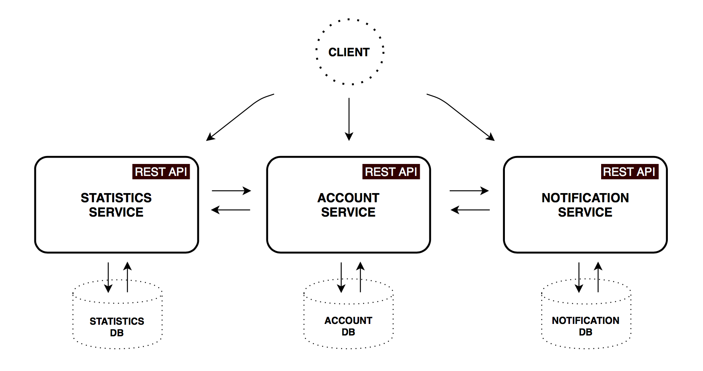

<!SLIDE center subsection>
# About demo

http://devdocker01.rtp.raleigh.ibm.com/

<!SLIDE transition=turnUp>
# The architecture of Demo APP

<!SLIDE>
# Infrastructure services

.callout.thumbsup Two manager nodes ensure that even one of manager node is down, we can still hold the whole cluster

<!SLIDE>
# Micoservice Infrastructure

.callout.info http://devdocker-builder.rtp.raleigh.ibm.com:8080/

<!SLIDE>
# Capacity

- Scaling up/down at any time (on need basis)
- Failure handling
- Auto service discovery
- Real-time performance monitoring
- Real-time alerts monitoring

<!SLIDE transition=turnUp>
# Auto deploy

## Zero Down time deployments

<!SLIDE>
# 123
Have ability to handle increased load in a graceful manner or its potential to be enlarged as demand increases.
自动选择负载最低的服务器.
docker service scale gateway=3

杀掉一个docker 容器后, 会自动启动起来

当整个docker宕掉以后, 会在其他服务器上创建这些容器, gateway 仍然是3个

- Auto service discovery
> 当有新的机器被添加到集群中时, docker 会自动发现这台机器, 并部署相应的容器

- Real-time performance monitoring
> http://devdocker-builder.rtp.raleigh.ibm.com:3000/

- Real-time alerts monitoring

<!SLIDE transition=turnUp>
# Scalability

Scalability is the capability of a system, network, or process to handle a growing amount of work, or its potential to be enlarged to accommodate that growth.

- Increate node at any time
- Balance

# 部署